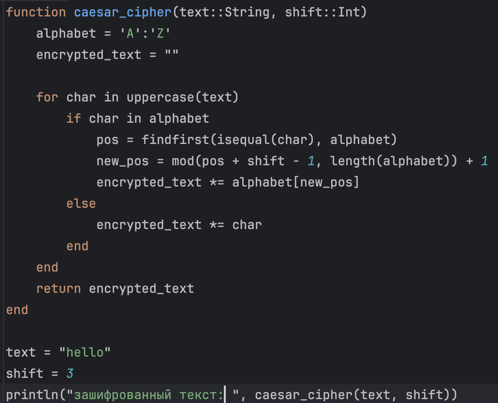
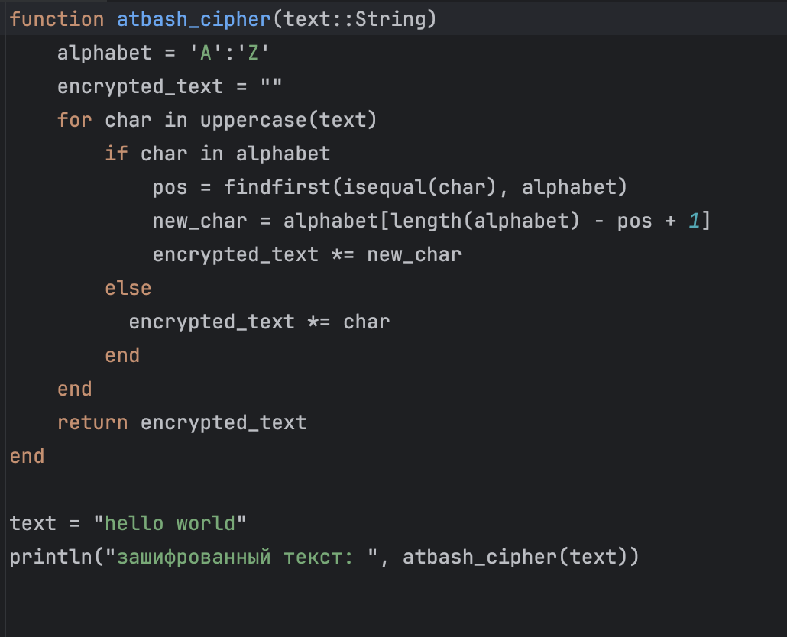

## Front matter
lang: ru-RU
title: Лабораторная работа №1
subtitle: "Шифры простой замены" 
author:
 - Федюшина Ярослава Андреевна
institute:
 - Российский университет дружбы народов, Москва, Россия
date: 19.09.2025
\

## Front matter
lang: ru-RU
title: Лабораторная работа №1
subtitle: "Шифры простой замены" 
author:
 - Федюшина Ярослава Андреевна
institute:
 - Российский университет дружбы народов, Москва, Россия
date: 19.09.2025

## i18n babel
babel-lang: russian 
babel-otherlangs: english 
mainfont: Arial 
monofont: Courier New 
fontsize: 12pt

## Formatting pdf
toc: false
toc-title: Содержание
slide_level: 2
aspectratio: 169
section-titles: true
theme: metropolis
header-includes:
 - \metroset{progressbar=frametitle,sectionpage=progressbar,numbering=fraction}
 - '\makeatletter'
 - '\beamer@ignorenonframefalse'
 - '\makeatother'
---

# Информация

## Докладчик

:::::::::::::: {.columns align=center}
::: {.column width="70%"}

  * Федюшина Ярослава Андреевна
  * Студентка
  * Обучающийся на кафедре теории вероятностей и кибербезопасности
  * Российский университет дружбы народов

:::
::::::::::::::

#Цель работы

Целью работы является изучение алгоритмов шифрования Цезаря и Атбаш, принцип работы, реализация на Julia. 

# Задание

1. Реализовать шифр Цезаря с произвольным ключом k
2. Реализовать шифр Атбаш

# Выполнение лабораторной работы

Суть шифра Цезаря заключается в том, что происходит смещение всех букв по алфавиту в сообщенгии на некоторый коэффициент k. Декодирование происходит путем смещения в обратную сторону.  (рис. [-@fig:001]).

{#fig:001 width=100%}

Шифр Атбаш похож на шифр Цезаря, но в данном алгоритме разворачивается весь алфавит, а не какой то маленький сдвиг.  (рис. [-@fig:002]).

{#fig:002 width=100%}
# Выводы

В результате выполнения лабораторной данной работы мы научились реализовывать два алгоритма шифрования - Цезарь и Атбаш. Оба алгоритма были реализованы на языке Julia. 