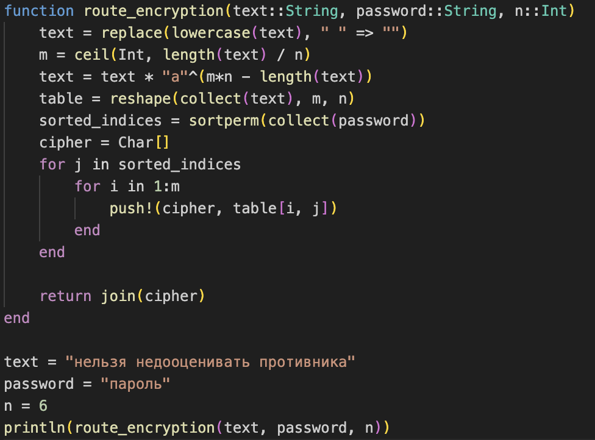
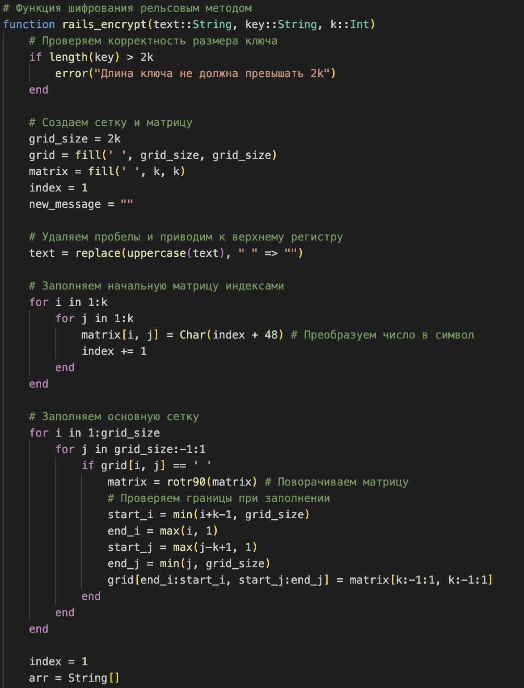
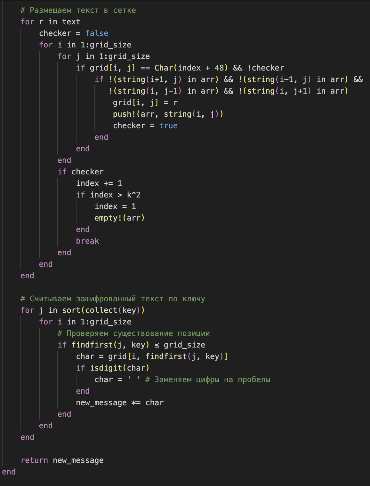
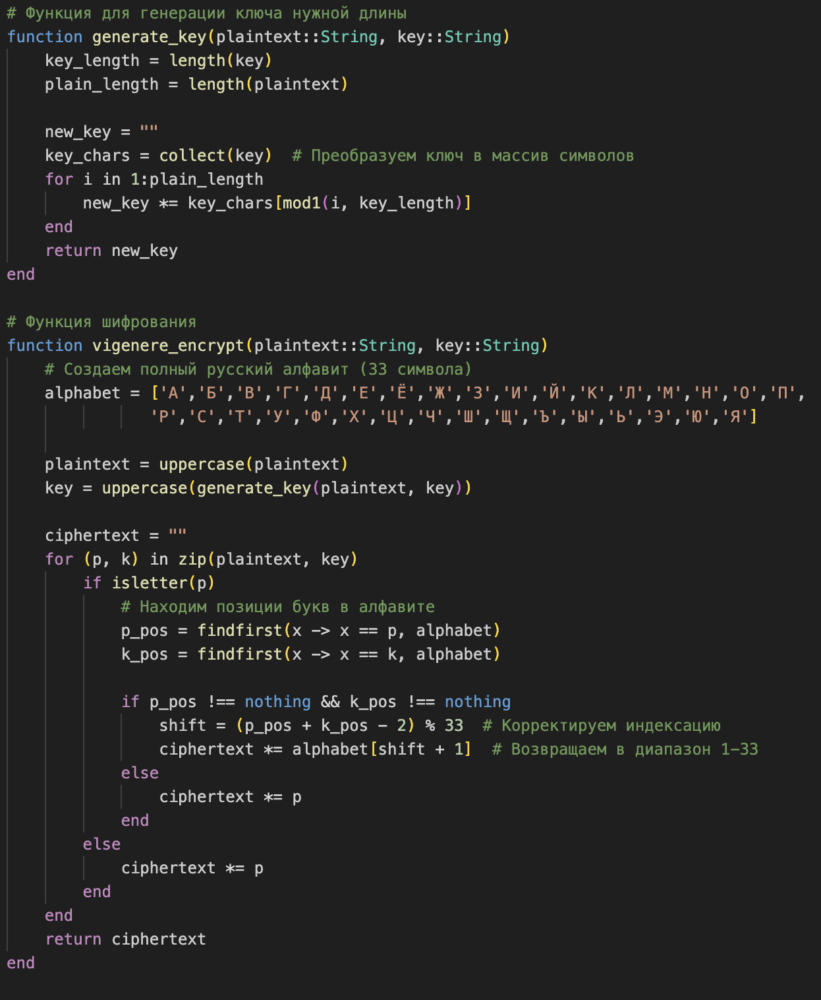
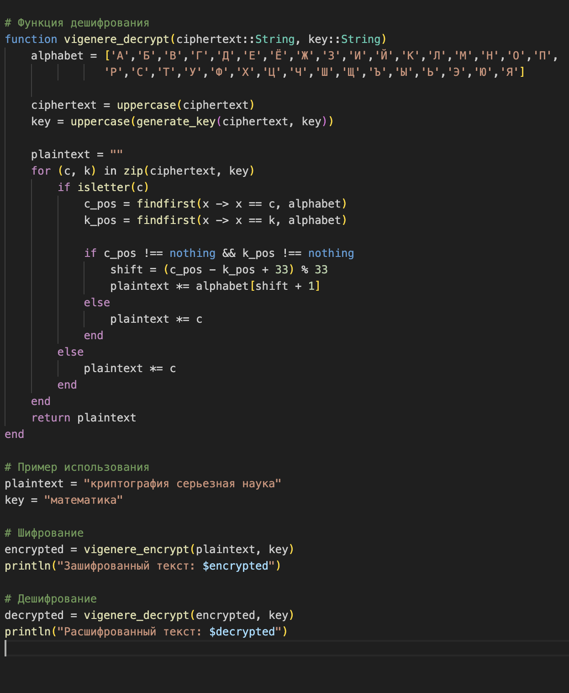

---
## Front matter
lang: ru-RU
title: "Шифры престановки"
subtitle: ""
author:
  - Федюшина Я. А. 
institute:
  - Российский университет дружбы народов, Москва, Россия
date: 24.09.2025

## i18n babel
babel-lang: russian 
babel-otherlangs: english 
mainfont: Arial 
monofont: Courier New 
fontsize: 12pt

## Formatting pdf
toc: false
toc-title: Содержание
slide_level: 2
aspectratio: 169
section-titles: true
theme: metropolis
header-includes:
 - \metroset{progressbar=frametitle,sectionpage=progressbar,numbering=fraction}
 - '\makeatletter'
 - '\beamer@ignorenonframefalse'
 - '\makeatother'
---

# Цель работы

  Целью данной лабораторной работы является изучение алгоритмов шифрования перестановки, принцип работы и реализация на языке Julia. 

# Задание

Реализовать все шифры программно. 

# Выполнение лабораторной работы

Маршрутное шифрование

{#fig:001 width=20%}

Шифрование с помощью решеток

{#fig:002 width=20%}
{#fig:003 width=20%}

Таблица Виженера

{#fig:004 width=20%}
{#fig:005 width=20%}

# Вывод

В ходе выполнения данной лабораторной работы были изучены три шифра перестановки, а так же были реализованы на языке Julia. 
